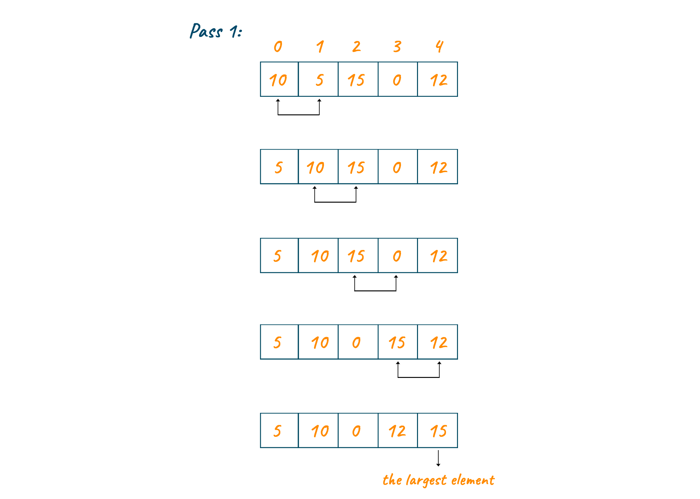
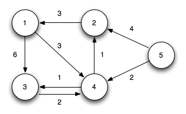

### Sorting
> **버블 정렬**
> 
> 
> 
> ```python
> ints = [3, 1, 2]
> for i in range(0, len(ints)):
>     for j in range (i, len(ints) - 1):
>         if ints[j] > ints[j + 1]:
>             ints[j], ints[j + 1] = ints[j + 1], ints[j]
> ```

> **퀵 정렬**
> 
> 
> 
> ```python
> def quick_sort(arr, l, r):
>     if l < r:
>         pivot = partition(arr, l, r)
>         quick_sort(arr, l, pivot - 1)
>         quick_sort(arr, pivot + 1, r)
>         
> def partition(arr, l, r):
>     pivot = arr[r]
>     i = l - 1
>     for j in range(l, r - 1):
>         if arr[j] <= pivot:
>             i += 1
>             arr[i], arr[j] = arr[j], arr[i]
>     arr[i + 1], arr[r] = arr[r], arr[i + 1]
>     return i + 1
> ```

> 최단 경로 **다익스트라** 알고리즘
> 
> 
> 
> ```python
> nodes, lines = 5, 8
> start = 1
> graph = [[] for i in range(nodes + 1)]
> dist = [float('inf')] * (nodes + 1)
> graph[1].append((3, 6))
> graph[1].append((4, 3))
> graph[2].append((1, 3))
> graph[3].append((4, 2))
> graph[4].append((3, 1))
> graph[4].append((2, 1))
> graph[5].append((2, 4))
> graph[5].append((4, 2))
> 
> def dijkstra(start):
>     q = []
>     heapq.heappush(q, (0, start))
>     dist[start] = 0
>     while q:
>         distance, now = heapq.heappop(q)
>         if dist[now] < distance:
>             continue
>         for i in graph[now]:
>             cost = distance + i[1]
>             if cost < dist[i[0]]:
>                 dist[i[0]] = cost
>                 heapq.heappush(q, (cost, i[0]))
> ```

**[home](./README.md)**