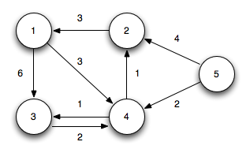

# Python Code Snippets
### 1. String manipulation (~165p)
> 2차원 배열 ['1, B', '2, A']에서 **두 번째 요소(알파벳)순으로 정렬**
> 
> ``` python
> strs = ['1, B', '2, A']
> strs.sort(key=lambda x: (x.split()[1:], x.split()[:1]))
> ```

> 문자열에 **숫자와 문자만 남기기**  
> 
> ``` python
> strs = 'A man, a plan, a canal: Panama'
> for s in strs:
>     if s.isalnum():
>         pass
> ```

> **리스트로 단어 골라내기**
> 
> ```python
> strs = ['a', 'b', 'c', 'd']
> banned = ['a']
> result = [word for word in strs if word not in banned]
> ```

> 리스트 요소 중 **최빈 값, 빈도 찾기**
> 
> ```python
> strs = ['a', 'a', 'b', 'c', 'd']
> value = collections.Counter(strs).most_common()[0][0]
> count = collections.Counter(strs).most_common()[0][1]
> ```
### 2. List manipulation (~198p)
> **원본 리스트 정렬**, **원본 리스트 유지하며 정렬**
> 
> ```python
> strs = ['1', '3', '2']
> strs.sort()
> sorted_strs = sorted(strs)
> ```

> 리스트 **중복 값 제거**
> ```python
> strs = ['1', '3', '3']
> list(set(strs))
> ```

> **최댓값 최솟값** 지정
> 
> ```python
> mx = -sys.maxsize
> mn = sys.maxsize
> mx = float('inf')
> mn = float('-inf')
> ```
### 3. Linked list manipulation (~239p)
> **데크**
> 
> ```python
> strs = collections.deque()
> strs.append('a')
> strs.appendleft('a')
> strs.pop()
> strs.popleft()
> ```

> **리스트를 문자열로**
> 
> ```python
> strs = ['a', 'b', 'c']
> ''.join(word for word in strs)
> ''.join(strs)
> ```

> **스왑**
> 
> ```python
> a = 1
> b = 2
> a, b = b, a
> ```
### 4. Stack, Queue manipulation (~265p)
> 리스트 **기본값** 설정
> 
> ```python
> T = [1, 2, 3, 4]
> strs = ['기본값'] * len(T)
> ```

> **우선순위 큐**
> 
> ```python
> heap = []
> heapq.heappush(heap, (1, 'b'))
> heapq.heappop(heap)
> ```

> **최대 힙** 구현
> 
> ```python
> heap = [1, 3, 5, 7, 9]
> max_heap = []
> for item in heap:
>     heapq.heappush(max_heap, (-item, item))
> ```
### 5. Hash table manipulation (~313p)
> **딕셔너리로 개수 확인**
> 
> ```python
> dic = {}
> strs = ['a', 'a', 'b']
> for word in strs:
>     if word in dic:
>         dic[word] += 1
>     else:
>         dic[word] = 1
> ```

> **딕셔너리 키, 값 스왑, 값으로 키 찾기**
> 
> ```python
> dictionary = {1: 3, 2: 2}
> swap_dict = dict(map(reversed, dictionary.items()))
> ```

> **최빈 값, 빈도 상위 k개를 갖는 딕셔너리**
> 
> ```python
> k = 1
> strs = ['a', 'a', 'b', 'c', 'd']
> value = collections.Counter(strs).most_common(k)
> ```
### 6. Graph (~370p)
> **2차원 리스트에서 값의 위치 찾기**
> 
> ```python
> strs = [['a', 'b'], ['c', 'd']]
> n = len(strs)     # 행
> m = len(strs[0])  # 열
> positions = [(i, j) for i in range(n) for j in range (m) if strs[i][j] == 'c']
> ```

> 리스트 참조 없이 **깊은 복사**
> 
> ```python
> strs = ['a', 'b', 'c']
> new_strs = strs[:]
> ```

> **중복 리스트 요소 제거**
> 
> ```python
> lists = [[1, 2], [2, 1], [3, 3, 3], [2, 1]]
> unique_ints = [list(item) for item in {tuple(sorted(list)) for list in lists}]
> ```

> **2차원 리스트에서 열 추출**
> 
> ```python
> lists = [
>     [0, 1],
>     [2, 3],
>     [4, 5],
>     [6, 7],
>     [8, 9],
> ]
> column = [e[k] for e in lists] # k 번째 열
> ```

> **리스트에서 값의 인덱스를 모두 찾기**
> 
> ```python
> strs = ['a', 'a', 'b', 'c', 'd']
> index = list(filter(lambda x: strs[x] == 'a', range(len(strs))))
> 
> lists = [
>     [0, 1],
>     [2, 3],
>     [4, 5],
>     [6, 7],
>     [8, 9],
> ]
> index = list(filter(lambda x: lists[x][0] == 2, range(len(lists)))) # 1 번째 열에서 찾기
> ```
### 7. Shortest path problem (~382p)
> 최단 경로 **다익스트라** 알고리즘
> 
> 
> 
> ```python
> nodes, lines = 5, 8
> start = 1
> graph = [[] for i in range(nodes + 1)]
> dist = [float('inf')] * (nodes + 1)
> graph[1].append((3, 6))
> graph[1].append((4, 3))
> graph[2].append((1, 3))
> graph[3].append((4, 2))
> graph[4].append((3, 1))
> graph[4].append((2, 1))
> graph[5].append((2, 4))
> graph[5].append((4, 2))
> 
> def dijkstra(start):
>     q = []
>     heapq.heappush(q, (0, start))
>     dist[start] = 0
>     while q:
>         distance, now = heapq.heappop(q)
>         if dist[now] < distance:
>             continue
>         for i in graph[now]:
>             cost = distance + i[1]
>             if cost < dist[i[0]]:
>                 dist[i[0]] = cost
>                 heapq.heappush(q, (cost, i[0]))
> ```
### 8. Tree (~445p)
> **순열**
> 
> ```python
> lists = [1, 2, 3, 4]
> tuple_list = itertools.permutations(lists)
> list_list = map(list, itertools.permutations(lists))
> ```

**[home](./README.md)**